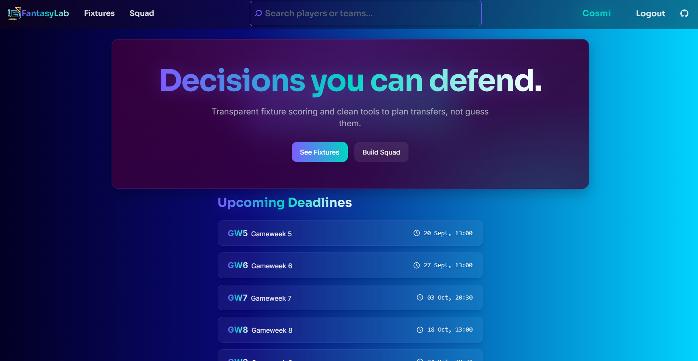
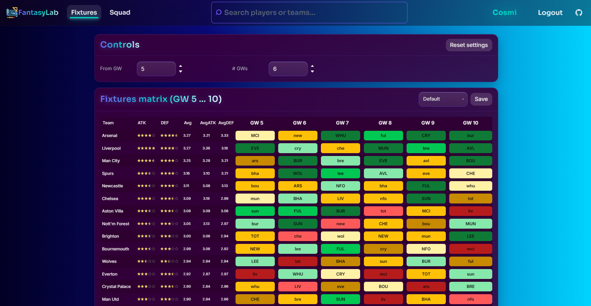
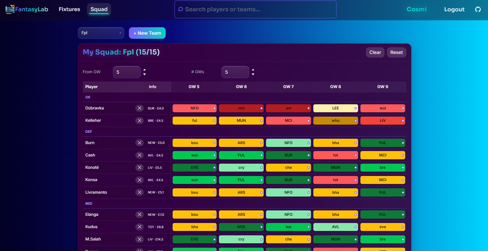

# FantasyLab

A modern, full-stack web app for fantasy football management. Build your squad, track fixtures, and analyze player performance with real-time data from the Fantasy Premier League API.

Describe your team, select players, and let the app handle transfers, predictions, and more. This project integrates with the official FPL API for accurate data, using a secure backend via Railway.

## Demo

[Live Demo]([https://fantasylab.netlify.app/](https://fantasylabrmc.netlify.app/))

## Screenshots

  
  


## Features

• Fast, modern UI built with React + Vite + Tailwind CSS  
• Squad building: Add/remove players,select starters, manage transfers, view ratings  
• Fixture analysis: Interactive matrix with difficulty ratings (FDR)  
• Real FPL API integration (live data, not static)  
• Secure backend: Express + MongoDB with JWT auth  
• Responsive & mobile-ready: Looks great everywhere  
• Accessible: High contrast, keyboard navigation  
• Player search: Global search with filters

## How it works (API & Backend integration)

• When you interact with the app, it fetches data from the FPL API via the backend.  
• The backend (in `server/`) acts as a proxy: it handles auth, caches data, and syncs with MongoDB.  
• The frontend receives responses and displays real-time updates.  
• No sensitive data is exposed to the client; all API calls go through the secure backend.

## Tech Stack

• React (with hooks)  
• Vite (fast dev/build)  
• Tailwind CSS (utility + custom classes)  
• Express.js (backend API)  
• MongoDB (database)  
• JWT (authentication)  
• Railway (backend hosting)  
• Netlify (frontend hosting)  
• ESLint (clean code)  
• No traditional server needed beyond Railway

## Getting Started (Local & Deploy)

### Local development

You can run the UI locally (`npm run dev`), but for full functionality with live data, you need to deploy the backend.

#### Backend:

```
cd server
npm install
npm run dev
```

#### Frontend:

```
cd web
npm install
npm run dev
```

Create `.env` files from the provided `.env.example` templates.

### Deploy on Netlify + Railway (get full functionality!)

1. Fork/clone this repo
2. Create a free Railway account at [railway.app](https://railway.app/)
3. Create a free Netlify account at [netlify.com](https://netlify.com/)
4. Deploy backend on Railway:
   - Import repo, set Root Directory to `server`
   - Add env vars: `MONGO_URI`, `JWT_SECRET`, `CORS_ORIGIN`
   - Deploy and note the URL (e.g., https://your-api.up.railway.app)
5. Deploy frontend on Netlify:
   - Import repo, set Base Directory to `web`
   - Build command: `npm run build`
   - Publish directory: `dist`
   - Add env var: `VITE_API_BASE=https://your-api.up.railway.app/api`
   - Deploy

That’s it! The backend will handle API calls securely, and the UI will "just work".

## Requirements

• Node.js (v18.x or v20.x)  
• VS Code (recommended)  
• VS Code extensions:  
 ◦ ES7+ React/Redux snippets  
 ◦ Tailwind CSS IntelliSense  
 ◦ Prettier

## Author

Cosmin Marius Rotaru  
[GitHub](https://github.com/CosminMRotaru)  
[LinkedIn](https://www.linkedin.com/in/marius-cosmin-rotaru-a8a242262/)

## License

MIT


